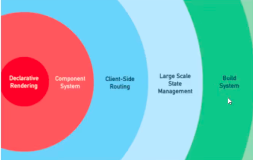

# interview

##  v-if & v-for
- 在设计的时候就出现了问题
  - 其实就是vue的源码那里，他的 for 执行优先级高于 if 
- 源码位置
 - /src/compailr/codegen/index  => genElement
## vue 的 data 为什么只能是一个函数

- 过不了编译，是因为他做了一层判断而已
- 在根判断的时候，会有一个 实例的判断
- 中间有一个地方用来保存所有的全局变量 data， 就会出现重复
- 源码位置
  - /src/core/instance/state => initData

## vue 的 v-for 为什么需要绑定 key
- 当一个数组中改变了一个数据的时候 都会重头开始执行 `updateChilren`, 导致很多的浪费。  
- 当存在 `key` 的时候，就会跳过这样的过程
  - 但是需要注意的是 用 `index` 会出现 `渲染的bug` 
- /src/vdom/patch/ => updateChildren
## diff 算法
- [diff](./diff.md)
- /src/vdm/patch/ 

## 组件化
- /src/global-api/assacs 
  - 对于全局东西的导入和注册 
- /src/global-api/extend
  - 这里看到一个子组件,他会通过一个 Object.create, 继承Vue的所有方法 
  - 不同层级的组件,在不同的时机执行这个 `extend` 的东西执行组件的顺序
  - 上部组件先 `创建`
  - 下部组件先 `挂载` 

## vue 设计理念
- 渐进式的一种框架
  - 
    - 一般只会用到简单 核心的渲染和组件系统
- 易用性
  - 通过模板语法很好的解决了, 和分成的方式,解决问题 
- 高效性
  - vue3 还有更多的跟进 

## 为什么vue组件模板只有一个根元素
- 实例一个项目的时候,需要一个根组件 #app 这样的的东西
- 编译的使用也需要一个入口文件,来进行编写
- 在patchVnode 这样的函数在比较函数的时候, 他是一个树节点, 这个节点 也需要一个根节点 

## mvc mvp mvvm 的区别
- [mvc mvp mvvm](./mvvm.md)

## 性能优化
- [性能优化](performance.md)

## 生命周期
- 完整的从一个源码的角度去看待一个问题
  - 从 实例一个 `vue` 开始 (/instance/index)  
  - 一开始通过 `initMixin` 这样的操作执行数据的导入
    - 中间在执行数据的更新操作的期间会 很好的 调用
      - `beforeCreate`  
      - `created`  
  - 然后到了 runtime 的运行时代码处理
    - 他会做到一个挂载 元素这样
    - 然后回到 `lifecycle文件` 这样的元素上面,调用对应的生命周期函数
  - 中间还有一个 callHook 的文件,相当于用在一个函数的作用域中了

## $nextTick
- `vue` 通过异步队列的方式来控制 `dom更新` 之后 `nextick` 回调执行
- 优先使用 微任务循环,能确保队列的微任务再一次循环中,提前执行
- 因为兼容的问题,需要做很多的降级处理
  - 一些 `setimmeiate` 这些东西
  - 最后就是  `settimeout` 可能会有问题,但是也没有办法

## 双向数据绑定
- [双向数据绑定](./model.md)

## vue-router
- [router](./router.md)
  - 常见的面试问题

## 什么是递归组件
- 组件内部调佣组件