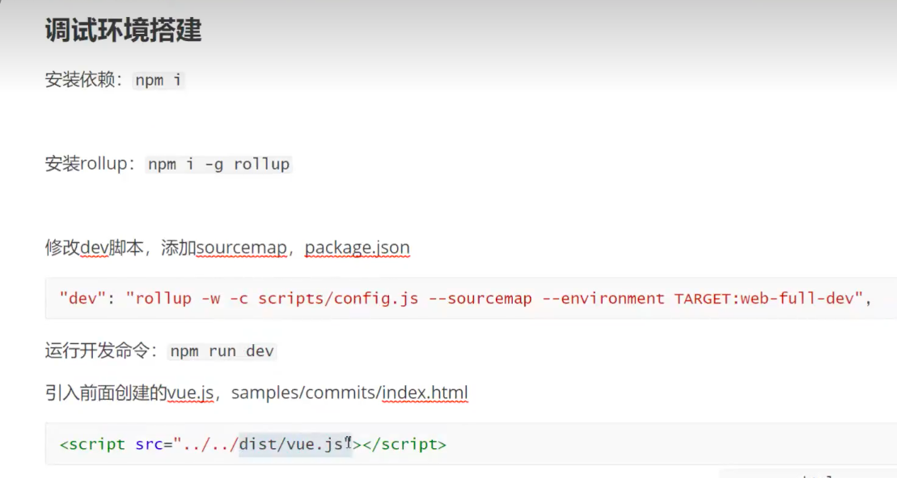

# 源码的学习方法

## 基本操作

### 环境的搭建(注意这个实在源码这里进行操作)
- npm i 下载文件
- npm i -g rollup
- 

### diff
- 说法
  - 3w1h
    - 是什么东西 
      - 虚拟dom 的出现导致
    - 有什么好处
      - 兼容性, 性能提升
    - 在哪里
      - pathVnode
    - 怎么做
      - 先通过比较  元素 等等
      - 比较 内容
      - 新增,删除节点的一些操作,
      - 主要 uptateChilren 这样的函数

